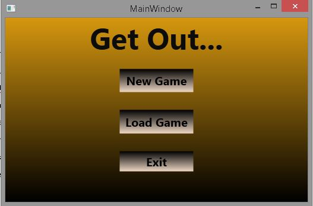
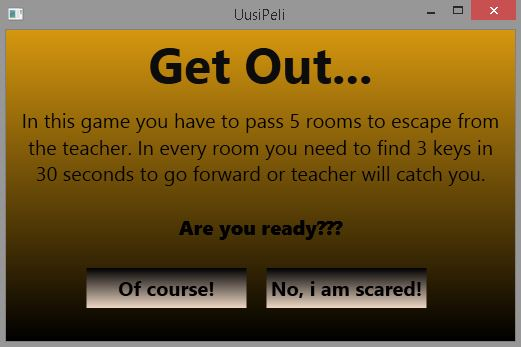
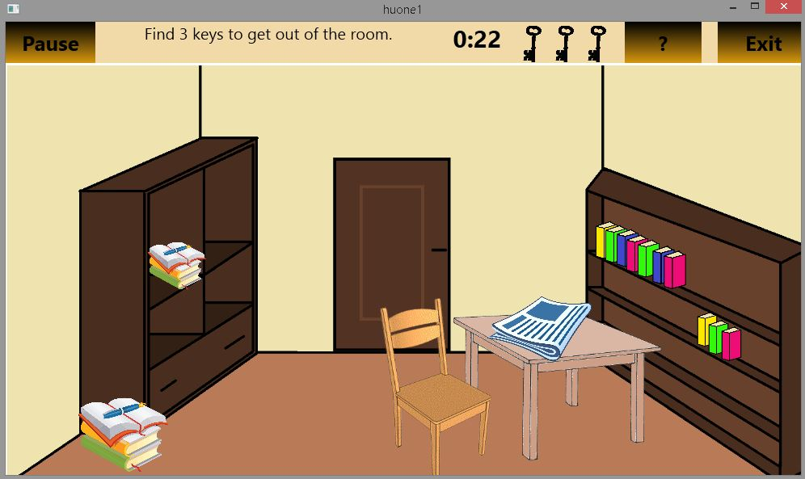
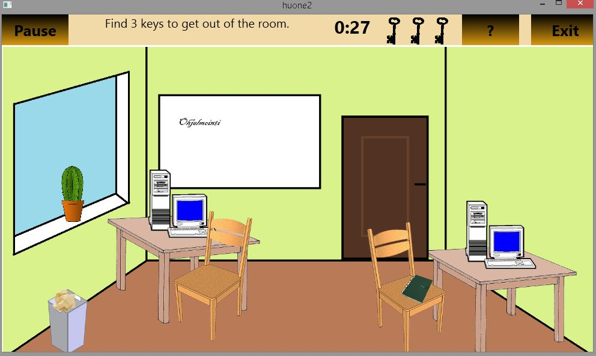
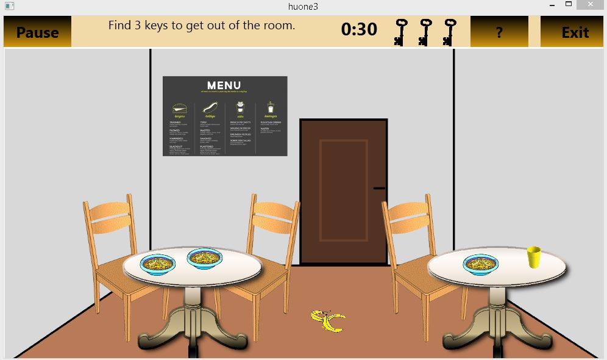
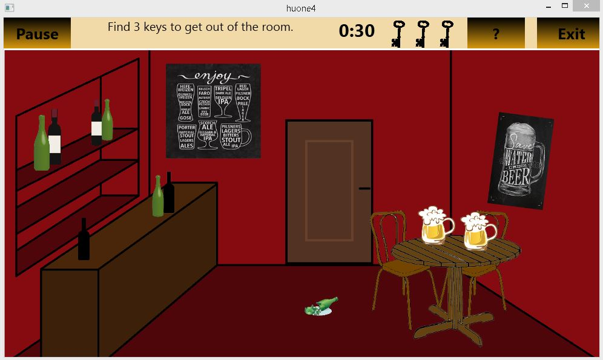
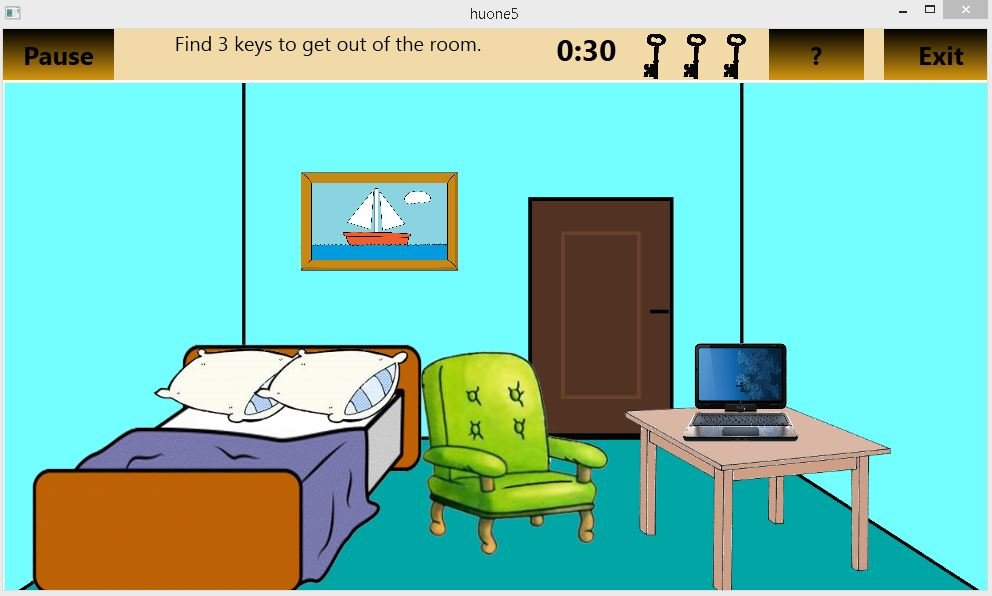
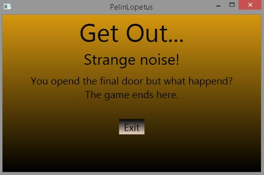

<h1>My Portfolio</h1>

<h2> Me </h2>

I'm third year student of Information and Communication Technology in ICT institution at the Jyväskylä's University of Applied Sciences. My specialization is Software Engineering. I graduaded from Seppä high school 2014, after that I worked little bit at nursing home Telkänpesä as a cleaner. Since that my work experience has accumulated mostly from cleaning work. 

<h2> My projects </h2>

<h3> Get Out </h3>

Small game made by C#. In this game we have five rooms where you have to find three keys to unlock the door so you get away from teatcher. You have a time limit to find those keys.

<h3> Around the world </h3>

<h3> GG-project </h3>

<h3> Landis+Gyr project </h3>
